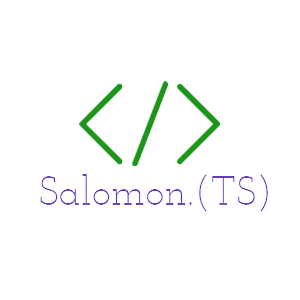

  
  
# Hi there 👋, I'm Salomon 😎
## A passionate web developer

## About me

|   |   |
|---|---|
| <ul><li>🌱 Currently improving my coding skills with Microverse program</li><li>💻 Passionate with problem solving using computer science</li><li>🕮 Always opened to learining</li><li>🔭 Love for science and innovation technologies</li></ul> |  |

## Skills

  

## GitHub Stats

